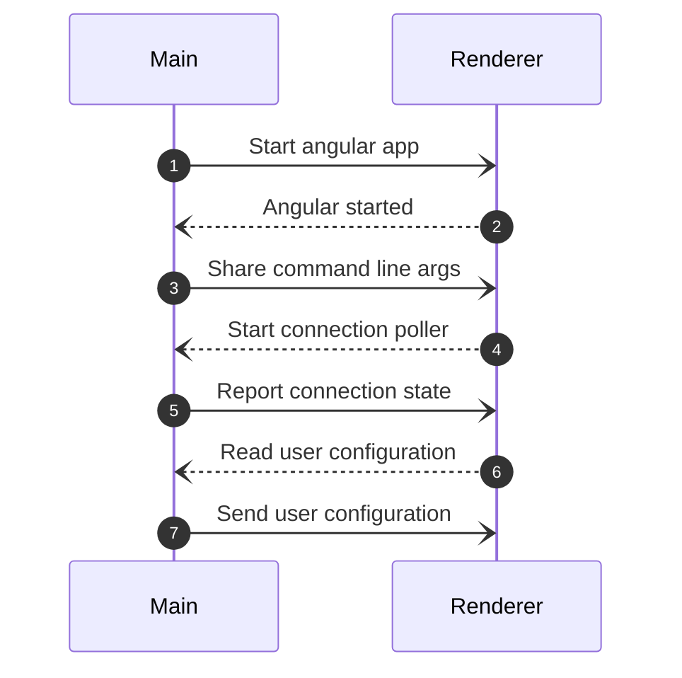

# Agent Start

The document contains how Agent starts and read user and hardware configuration.

Agent is an Electron application. It has 2 part
- the Main -> a Nodejs app
- the Renderer -> an Angular single page app

The main thread starts the Angular application.
The main thread can't send any data to the Angular app until it not started.

